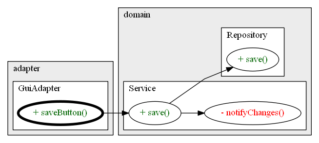
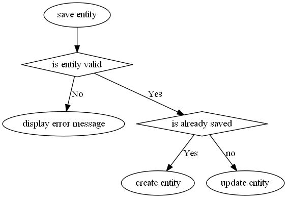
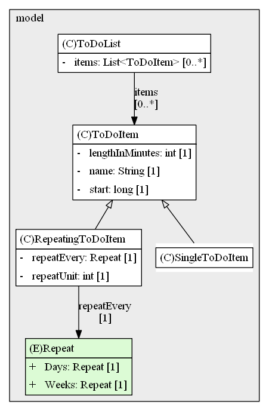
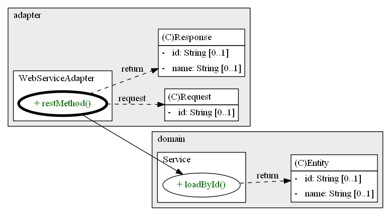

## What is this plugin about?

This Plugin allows you to create an as-is 2D diagram of your code base. You can show only a specific area or specific classes of your code base by customizing the filter logic. The resulting diagram file is in text form (PlantUML) and can be included in the documentation (e.g. AsciiDoc), reviewed in a version control diff or manually adjusted.

## Features

### Call Diagram

Display a call hierarchy as a graph and filter unnecessary methods.

### Flow Diagram

Instead of using a method call hierarchy the flow diagram contains actions and conditions describing the functionality on a high level.

[How To](howto_flow_diagram.md)

### Structure / Class Diagram

Show classes, their relationships, cardinalities and group them by components.

### Data Flow Diagram

This is a special combination between structure and call diagram. It allows you to show class structures in relation 
to their method calls. Just change the detailed configuration of a call diagram to edgeMode = TypesAndMethods. For bigger
diagrams you need to filter a lot otherwise the diagram contains too many nodes.

## HoTo 

* [Configuration](howto_configuration.md)
* [Context Menu](howto_context_menu.md)

## Installation Requirements
* Java 1.8 or later
* IntelliJ (2019.3 or newer)
* optional but recommended
  * Graphviz for diagram rendering (https://graphviz.gitlab.io/download/)
  * PlantUML Integration plugin (https://plugins.jetbrains.com/plugin/7017-plantuml-integration/)

## Layout tips
* before fine-tuning the layout - always check the key message of your diagram
  * documentation / overview - hide private methods / supports / until-classes or whatever is not functional relevant
  * analysis / bug fixing  
    * hide non-relevant functional branches 
    * use include filters to show classes/methods with a specific keyword
    * display only application entry points to see what event could trigger a method call (e.g. a REST call or GUI button could save an entity) 
  * show only one use case
* general metric for a good layout
  * low number of nodes/edges
  * low number of edge crossing
  * especially a high ratio of edges/node produces a lot of edge crossings
  * don't mix-up different concerns or abstraction levels

## Troubleshooting
* missing diagram elements
  * check your filter logic and naming patterns
  * if you use source code generation: ensure it was generated / build was triggered to perform the annotation based source code generation
  * manually check the call / type hierarchy
  * reflection magic / decoupling is not supported
* Graphviz Crashed - this indicated that the dot layout engine cannot arrange the nodes and edges
  * reduce the diagram complexity / edges per node
  * filter notes that are not important for the diagram
  * switch to a different layout engine (see https://graphviz.org/doc/info/attrs.html#d:layout)

## Further Ideas

* better diagram layout / use css for svg's
* call diagram using multiple methods at the same time
* configuration how to display skipped nodes via edges
  * tooltip to include skipped nodes for information
* configuration how to display parallel edges
  * way to reduce the number of edges
  * combine edges from class -> class
  * combine edges from method -> class
* provide a regeneration option including the GIT changes based on the main branch
  * genereate a new file containing the needed config
  * mark changes in the diagram
  * only show elements which are changed (only call diagram?)
  * see DvcsCompareWithBranchAction
* fields as nodes - search for assignments/usages of fields
  * getter/setter are hided
  * also considered usages via (local) variables and further usages
  * mapping table e.g. between entity and transport structure
* visualization improvements
  * configure a margin around class boxes for maybe better visualisation?
    * problem is that background color is also used inside the margin
  * level of indent for generated diagram elements

## Licensing

PlantUML Diagram Generator is licensed under the Apache License, Version 2.0 (the "License"); you may not use this project except in compliance with the License. You may obtain a copy of the License at http://www.apache.org/licenses/LICENSE-2.0.
