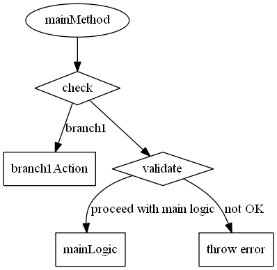

## Flow Diagram Usage

For generation of a flow diagram you need to add annotations in the code (this is different to call/structure diagram generation that works out of the box). They will indicate which
of the methods should be included in the diagram and which labels to be used. The basis of the generation is the call hierarchy. 
Every found method annotated with @FlowDiagramTerminal/@FlowDiagramAction/@FlowDiagramCondition will be displayed in the diagram.
A chain of calls can be interrupted by placing a @FlowDiagramStop annotation at the call to avoid cycles in the diagram. 
The main complexity lies in the branching logic. In general a branch in the diagram is created when ever a @FlowDiagramCondition 
is placed at a method. Every following action inside the method will be placed under this branch. A second branch must
follow directly after the first branch under the same condition node. Problematic are actions which cannot be placed in 
a method to be tagged as a branch. In this case the 'alternativeBranch' can be used to treat every following action to be under this branch.

Just copy the following annotations inside your code base. The diagram generator will only check the annotation's name and read the parameters dynamically.

<br/>
<details><summary><b>FlowDiagramTerminal</b></summary>
<p>

```java
import java.lang.annotation.ElementType;
import java.lang.annotation.Retention;
import java.lang.annotation.RetentionPolicy;
import java.lang.annotation.Target;
 
/**
 * Similar to an action but indicates the begin or ending of a flow. When a generation is triggered, a diagram is generated
 * for every method containing a Terminal annotation in the same class.
 */
@Target({ ElementType.CONSTRUCTOR, ElementType.METHOD, ElementType.TYPE_USE, ElementType.LOCAL_VARIABLE })
@Retention(RetentionPolicy.RUNTIME)
public @interface FlowDiagramTerminal {
 
    /**
     * @return optional, name of the diagram element or the method name if blank
     */
    String value() default "";
}
```

</p>
</details>

<br/>
<details><summary><b>FlowDiagramAction</b></summary>
<p>

```java
import java.lang.annotation.ElementType;
import java.lang.annotation.Retention;
import java.lang.annotation.RetentionPolicy;
import java.lang.annotation.Target;
 
/**
 * One step in the diagram flow.
 */
@Target({ ElementType.CONSTRUCTOR, ElementType.METHOD, ElementType.TYPE_USE, ElementType.LOCAL_VARIABLE })
@Retention(RetentionPolicy.RUNTIME)
public @interface FlowDiagramAction {
 
    /**
     * @return optional, name of the diagram element or the method name if blank
     */
    String value() default "";
}
```

</details>

<br/>
<details><summary><b>FlowDiagramCondition</b></summary>
<p>

```java
import java.lang.annotation.ElementType;
import java.lang.annotation.Retention;
import java.lang.annotation.RetentionPolicy;
import java.lang.annotation.Target;
 
/**
 * With a condition, the execution flow is divided in two or more branches.
 */
@Target({ ElementType.CONSTRUCTOR, ElementType.METHOD, ElementType.TYPE_USE, ElementType.LOCAL_VARIABLE })
@Retention(RetentionPolicy.RUNTIME)
public @interface FlowDiagramCondition {
 
    /**
     * @return name of the condition element
     */
    String value() default "";
 
    /**
     * @return name of the branch/arrow
     */
    String branch() default "";
 
    /**
     * The alternative branch contains all actions after the main branch is finished. E.g. if the main branch is a dead end.
     *
     * @return optional, name of the alternative branch/arrow
     */
    String alternativeBranch() default "";
}
```

</p>
</details>

<br/>
<details><summary><b>FlowDiagramStop</b></summary>
<p>

```java
import java.lang.annotation.ElementType;
import java.lang.annotation.Retention;
import java.lang.annotation.RetentionPolicy;
import java.lang.annotation.Target;
 
/**
 * The Stop is no diagram element but a marker to stop the processing of a flow. This is required to avoid cycles in the
 * diagram when generic methods are used twice.
 */
@Target({ ElementType.CONSTRUCTOR, ElementType.METHOD, ElementType.TYPE_USE, ElementType.LOCAL_VARIABLE })
@Retention(RetentionPolicy.RUNTIME)
public @interface FlowDiagramStop {
 
}
```

</p>
</details>


**Example**

```java
public class DiagramExample {
     
    @FlowDiagramTerminal
    public void mainMethod(){
        condition1Branch1();
        condition1Branch2();
    }
 
    @FlowDiagramCondition(value = "check", branch = "branch1")
    private void condition1Branch1() {
        branch1Action();
    }
 
    @FlowDiagramAction
    private void branch1Action() {
    }
 
 
    @FlowDiagramCondition(value = "check", branch = "branch2")
    private void condition1Branch2() {
        branch2SingleBranchCondition();
    }
 
    private void branch2SingleBranchCondition() {
        validate();
        mainLogic();
    }
 
    @FlowDiagramCondition(branch = "not OK", alternativeBranch = "proceed with main logic")
    @FlowDiagramAction("throw error")
    private void validate() {
    }
 
    @FlowDiagramAction // placed under alternativeBranch!
    private void mainLogic() {
    }
 
 
}
```

The resulting diagram looks like that:


